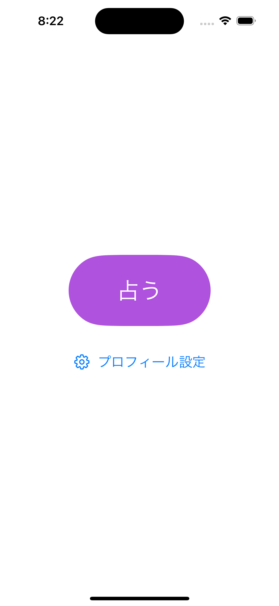
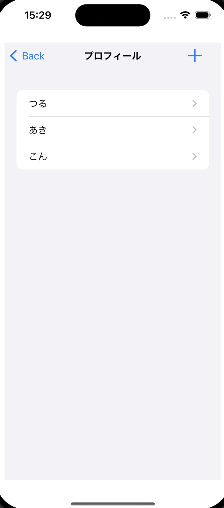
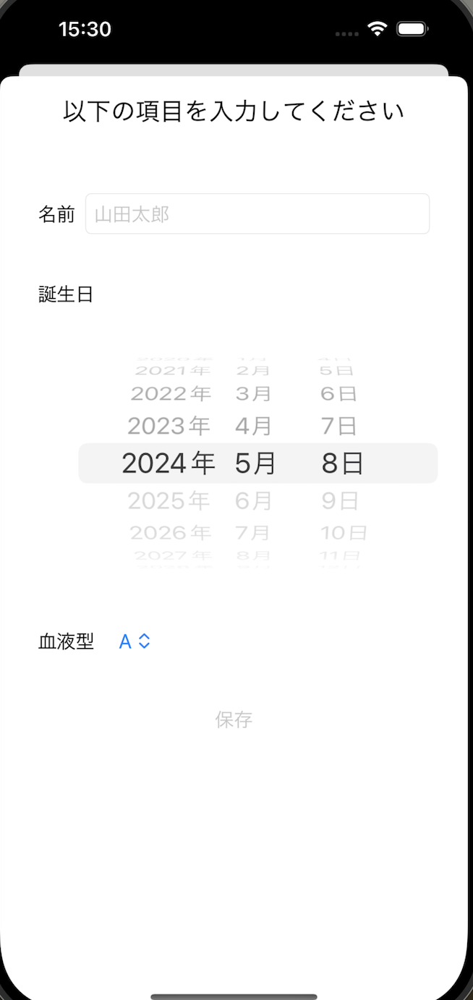

# yumemi-ios-codingtest

## 概要
株式会社ゆめみ　インターンiOS未経験者向課題

## アプリ仕様・動作・説明
本アプリは名前・誕生日・血液型を入力しておすすめの都道府県を表示するアプリです。日毎に提示される内容は変化します。
- iOS17以上
- iPhoneのみ、縦画面固定

| ホーム | ステータスリスト | 占い結果 | ステータス編集 |
| ------ | ------ | ------ | ------ |
|  |   |  |  |

| 横予定 | ダークモード |
| ------ | ------ |
| ||

## セットアップ方式
特になし。プロジェクトファイル内でライブラリは完結。

## コードについて
- フレームワーク：SwiftUI

## ライブラリ
- SwiftData
