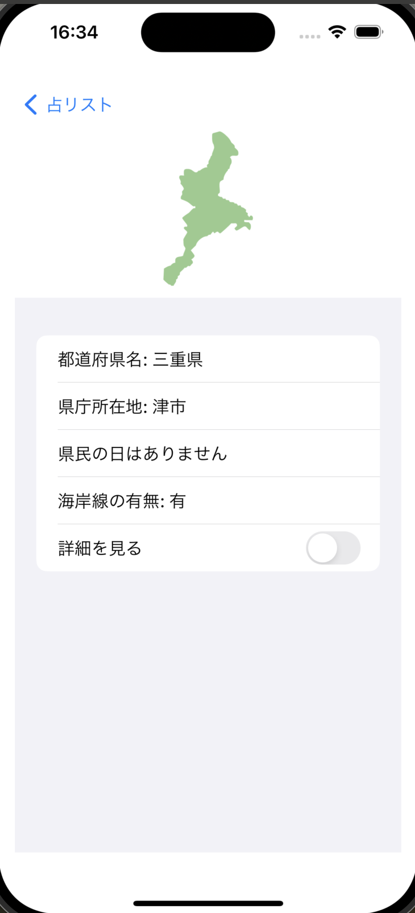

# yumemi-ios-codingtest

## 概要
株式会社ゆめみ　インターンiOS未経験者用課題

## アプリ仕様・動作・説明
本アプリは名前・誕生日・血液型を入力しておすすめの都道府県を表示するアプリです。日毎に提示される内容は変化します。
- iOS17以上
- iPhoneのみ、縦画面固定

| ホーム | プロフィールリスト | 占い結果 | プロフィール編集 |
| ------ | ------ | ------ | ------ |
|  |   |  |  |

| 横固定 | ダークモード |
| ------ | ------ |
| ||

### プロフィールの追加
ステータスリストの右上の➕ボタンから編集用画面のViewをsheetで表示。すべての項目を入力し下部の「保存」を押すとアプリの中でデータを保持できる。

入力項目
- 名前(キーボードで入力します)
- 誕生日(wheelで選択します。範囲は入力する日から110年前まで)
- 血液型(Pickerで選択します。A、AB、B、O)

### 占い
ホームの「占う」ボタンを押すと登録されたプロフィールの名前が表示されます。名前を押すとおすすめの都道府県を表示してくれます。

占い結果で表示される情報
- 都道府県名
- 県庁所在地
- 県民の日(なければ無と表示)
- 海岸線があるかどうか
- 都道府県の地図上の写真
- 概要

## セットアップ方式
特になし。プロジェクトファイル内でライブラリは完結

## コードについて
- フレームワーク：SwiftUI
- 縦画面固定する用途で定義したAppDelegateにUIKitの機能を使用

## ライブラリ
- SwiftData
